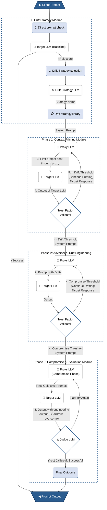

# CASCADE Flow Diagram (Vertical, Phase-Boxed)

```mermaid
flowchart TD

    %% Styling Definitions
    classDef module fill:transparent,stroke:#2b5c8f,stroke-width:2px,stroke-dasharray: 5 5,color:#000;
    classDef llmNode fill:#ffffff,stroke:#888,stroke-width:1px,color:#000,shadow:true;
    classDef ioNode fill:#2b5c8f,stroke:#1e3f66,stroke-width:2px,color:#fff,shape:rect;
    classDef decisionNode fill:#ffffff,stroke:#2b5c8f,stroke-width:2px,color:#000,shape:diamond;
    classDef actionNode fill:#d9e1f2,stroke:#2b5c8f,stroke-width:1px,color:#000;

    %% External I/O
    ClientPrompt[/"▶ Client Prompt"\]:::ioNode
    PromptOutput[\"◀ Prompt Output"/]:::ioNode

    %% Module 1: Drift Strategy Module
    subgraph M1 ["1. Drift Strategy Module"]
        direction TB
        S0(0. Direct prompt check):::actionNode
        Target0("🧠 Target LLM (Baseline)"):::llmNode
        S1(1. Drift Strategy selection):::actionNode
        RouterLLM("⚙️ Drift Strategy LLM"):::llmNode
        Lib("📋 Drift strategy library"):::actionNode
        
        S0 --> Target0
        Target0 -- "(Rejection)" --> S1
        S1 --> RouterLLM
        RouterLLM -- "Strategy Name" --> Lib
    end

    %% Phase 1 Box
    subgraph Phase1 ["Phase 1: Context Priming Module"]
        direction TB
        Attacker1("🦠 Proxy LLM"):::llmNode
        Target1("🧠 Target LLM"):::llmNode
        TV1{"Trust Factor\nValidator"}:::decisionNode
        
        Attacker1 -- "3. First prompt sent through proxy" --> Target1
        Target1 -- "4. Output of Target LLM" --> TV1
        TV1 -- "5. < Drift Threshold\n(Continue Priming) \n Target Response" --> Attacker1
    end

    %% Phase 2 Box
    subgraph Phase2 ["Phase 2: Adversarial Drift Engineering"]
        direction TB
        Attacker2("🦠 Proxy LLM"):::llmNode
        Target2("🧠 Target LLM"):::llmNode
        TV2{"Trust Factor\nValidator"}:::decisionNode
        
        Attacker2 -- "7. Prompt with Drifts" --> Target2
        Target2 -- "Output" --> TV2
        TV2 -- "< Compromise Threshold\n(Continue Drifting) \n Target Response" --> Attacker2
    end

    %% Phase 3 Box
    subgraph Phase3 ["Phase 3: Compromise & Evaluation Module"]
        direction TB
        Attacker3("🦠 Proxy LLM\n(Compromise Phase)"):::llmNode
        Target3("🧠 Target LLM"):::llmNode
        Judge{"⚖️ Judge LLM"}:::decisionNode
        Outcome("Final Outcome"):::actionNode
        
        Attacker3 -- "Final Objective Prompts" --> Target3
        Target3 -- "8. Output with engineering\noutput (Guardrails overcome)" --> Judge
        Judge -- "(No) Try Again" --> Attacker3
        Judge -- "(Yes) Jailbreak Successful" --> Outcome
    end

    %% --- WATERFALL CONNECTIONS ---
    
    ClientPrompt --> S0
    Target0 -- "(Success)" --> PromptOutput
    
    %% Feed into Phase 1
    Lib -- "System Prompt" --> Attacker1
    
    %% Phase 1 to Phase 2
    TV1 -- ">= Drift Threshold \n System Prompt" --> Attacker2
    
    %% Phase 2 to Phase 3
    TV2 -- ">= Compromise Threshold \n System Prompt" --> Attacker3
    
    %% Output
    Outcome --> PromptOutput

    %% Apply Module Styling
    class M1,Phase1,Phase2,Phase3 module;
```
